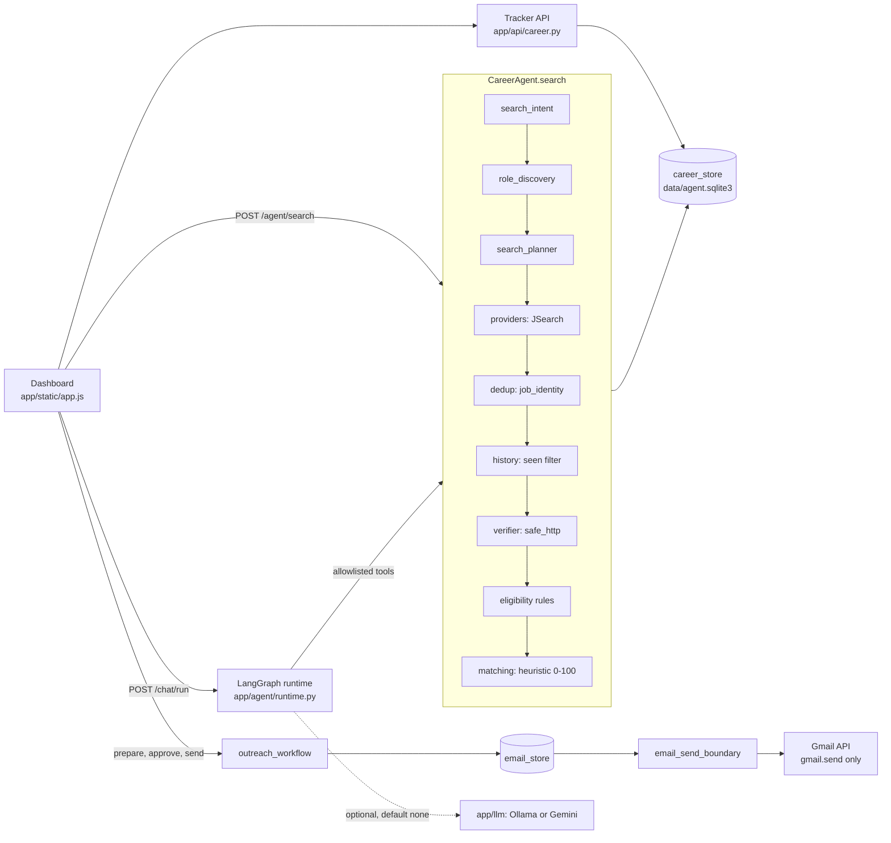

# Career Agent: Audit and Roadmap

Status date: 2026-09-25 · Baseline commit `ede0d3c` · Phase 1 (documentation only)

## Executive summary

**Current state.**
- The codebase is healthier than the original brief assumed. The offline suite passes (`python run_tests.py`: 204 tests, plus the dashboard and smoke scripts).
- Outbound HTTP is SSRF-safe, OAuth tokens are encrypted, and sends go through an atomic approve → send boundary with at most one attempt.
- Five of the nine suspected bugs were already fixed or never existed (§2).
- The real defects are elsewhere:
  - substring-matching bugs that mislabel jobs;
  - a job-side skill vocabulary that can't see GenAI skills;
  - graduation-year parsing that fails on the standard Indian CV layout;
  - two unguarded endpoints;
  - a data model that can't record the outcomes the research goal depends on.

**Top risks.**
1. *Wrong results for the target users:* "International" marks a job fresher-friendly; LangChain, FAISS and RAG-eval never match; Class X/XII years wipe out the graduation year.
2. *Security:* `POST /attachments` accepts cross-site uploads, and a side-effecting GET burns the paid API quota.
3. *No outcome data:* statuses, event history and frozen features are all missing, so every week without M2 is a week of lost labels.
4. *Sample size:* a single student's outcomes can't support calibration claims. Pooled data or a narrower claim is required.
5. *Claim inflation:* a heuristic score presented as a "probability" would undermine the research framing.

**Milestone order** (revised 2026-09-25; M1A is complete on `m1a-correctness`):
- **M1B** hygiene: pyproject, `tests/`, CI, storage migrations, DEMO_MODE/Docker
- → **M1C** index-first Company Radar, job identity resolution, daily sync, 7 am self-digest
- → **M1D** IMAP job-alert ingestion, bookmarklet capture, 3-way eligibility
- → **M2** outcome tracker, 👍/👎 relevance labels
- → **M3** evidence matrix, ESCO skill graph, scam rules, job lifecycle observatory (ATS aggregates only)
- → **M4** LLM-teacher → calibrated model; competition/timing-aware ranking
- → **M5** grounded outreach, MCP server, showcase

**Decisions already made** (recorded in §7):
- Local Ollama by default; hosted models are opt-in only.
- scikit-learn is approved for M4.
- fastembed is an optional dependency.
- Interview prep is out of scope.

**Decisions still needed** (§7):
- Can you recruit 10–30 students for pooled data? This changes what M4 is allowed to claim.
- The hosted-demo platform.
- The default send rate limits.
- Whether to delete or keep the legacy `/jobs/search-and-rank` endpoint.

**Claim levels used throughout this document** (§6.1):

| Level | Name | Meaning |
|---|---|---|
| L0 | Heuristic score | Deterministic |
| L1 | Prior estimate | Heuristic mapped to [0,1]; not calibrated |
| L2 | Model estimate | Learned from data; not yet validated |
| L3 | Calibrated probability | Validated on held-out outcomes |
| L4 | Causal claim | Not claimed anywhere in this roadmap |

---

## 1. Architecture



**Keep these strengths:**
- DNS-pinned, bounded fetching (`safe_http.py`).
- One-attempt sends (`email_send_boundary.py:25-47`).
- Fernet-encrypted tokens (`token_store.py`).
- OAuth query strings redacted from logs (`oauth_logging.py`).
- Bounded query planning (`search_planner.py`).
- Concurrent verification under a semaphore (`career_agent.py:150-155`).
- Explained eligibility and match results.
- Tests that block live network access (`run_tests.py:20-23`).

---

## 2. Verdict on the suspected issues

| Suspicion | Verdict | Evidence |
|---|---|---|
| `"\\n\\n"` in email f-strings | Refuted | `email_composer.py:89-90` uses real `'\n'` |
| Hard-coded personal data (SETU, IIT Patna, name, 2025) | Refuted | No match in `app/`. `core/preferences.py:4-9` is a fictional demo profile. The real single-user risk is B6. |
| `ACTIVE_PATTERNS` contains bare "apply" | Refuted | No such constant exists. `APPLY_PATTERN` (`application_verifier.py:18`) is an anchored full match on the label of an enabled, role-scoped control (`:54-69`). |
| JS-rendered ATS pages always come back unverified | Confirmed | `application_verifier.py:125-129`: the best case is `LIKELY_ACTIVE` (recent posting on a known ATS domain); Workday ends up `UNVERIFIED` |
| Sequential verification | Partly true | Only the legacy `search_pipeline.py:15-25` path (`main.py:221-229`) is sequential; `CareerAgent` is concurrent |
| History DB stored in `app/storage/` | Confirmed | `history.py:10`; `run_tests.py:19` has to monkeypatch it |
| No tests, CI, lint or types | Partly true | 204 unittest tests pass. No CI, `pyproject.toml`, ruff, mypy or coverage. `test_smoke.py` runs its asserts at import time. |
| No LLM | Partly true | Ollama and Gemini adapters exist but only for chat routing and explanations (`agent/routing.py:84-99`). The default is `none` (`llm/factory.py:28`); Gemini is benchmark-only (`:46-47`). |
| Fixed skill list; graduation year guessed from "2025" | Mostly refuted | CV Skills sections accept any skill (`cv_parser.py:124-132,167`), and the year comes only from Education lines. But see B4 and B5. |

---

## 3. Findings

Severity: **C**ritical (wrong results for target users, or an exploitable gap), **H**igh, **M**edium, **L**ow. "(r)" means reproduced; see Appendix A.

### 3.1 Correctness

| ID | Sev | Location | Finding |
|---|---|---|---|
| B1 | C (r) | `providers/jsearch_provider.py:11-16,121` | `"intern"` is matched as a substring, so "International" and "Internal" set `fresher_allowed=True`. A senior 5+ year role came back fresher-friendly. That flag feeds the 0–2-year exception (`eligibility.py:34`). |
| B2 | H (r) | `services/eligibility.py:55` | `'intern' in employment` rejects "Internal Tools Engineer" as an internship |
| B3 | H (r) | `services/matching.py:10` | `.replace('qa','testing')` runs on raw text: "Qatar" becomes `testingtar` |
| B4 | C (r) | `cv_parser.py:11-38`, used for jobs at `jsearch_provider.py:123` | The job-side vocabulary lacks LangChain, LangGraph, Transformers, FAISS, vector databases, LoRA and MLOps, so the 35-point skill component (`matching.py:19`) is blind for GenAI roles. `"R"` also matches "R&D". |
| B5 | C (r) | `cv_parser.py:155-161` | Any second year in Education (Class X/XII) makes the graduation year `None`. From there, batch filters drop to warnings (`eligibility.py:25`). |
| B6 | H | `storage/profile_store.py:12-18,28-29` | The write is not atomic, and a corrupt file silently loads the demo profile, so recommendations are made for a fictional person |
| B7 | M | `storage/preference_store.py:10-18` | Once `preferences.json` exists, a re-uploaded CV never updates the graduation year or experience limits |
| B8 | M | `services/search_pipeline.py:27,30` | The legacy path ignores saved preferences, marks jobs seen by `(company, title)`, and bypasses intent parsing and planning |
| B9 | M | `matching.py:26-29` | Transferable-skill lists are hard-coded for QA and analyst titles only |
| B10 | L | `matching.py:19-44` | Component maximums sum to 105 and are capped at 100 |
| B11 | L | `eligibility.py:44` | `\blead\b` treats "Lead Generation Executive" as a senior title |
| B12 | L | `outreach_workflow.py:54-60` | A contact stored as a URL (allowed by `api/career.py:102`) becomes the email recipient and fails with a generic error |

### 3.2 Security

| ID | Sev | Location | Finding |
|---|---|---|---|
| S1 | H | `main.py:251-259`; `attachment_store.py:77` | `POST /attachments` has no origin check, so any website can make a multipart "simple request" that writes files. The response also leaks the absolute `stored_path`. |
| S2 | H | `main.py:221-229` | `GET /jobs/search-and-rank` makes paid JSearch calls and calls `mark_seen`, and can be triggered cross-site |
| S3 | L | `main.py:143`, `:289-292` | `/cv/parse` and the Gmail disconnect endpoint skip `require_local_origin` |
| S4 | M | `core/origin_security.py:5`; `main.py:83-84` | `localhost:8010` is hard-coded, which blocks Docker and the demo |
| S5 | L | `gmail_service.py:76,96-108` | `include_granted_scopes="true"`, and the granted scopes are never checked against exactly `gmail.send` |
| S6 | M | `services/email_send_boundary.py:25-47` | No send rate limits (per day, minimum gap, per company) |

### 3.3 Performance, code quality, testing

| ID | Sev | Location | Finding |
|---|---|---|---|
| P1 | M | `career_store.py:25-69`; `career_agent.py:179` | Each connection re-runs the full DDL, and there is one connection per job |
| P2 | L | `career_agent.py:148,179,194` | Synchronous SQLite calls inside an async handler |
| P3 | L | all stores | No WAL mode; five copies of the connect/ensure helper |
| Q1 | M | `jsearch_provider.py:18-23,47-71` | Dead code: `SKILL_TERMS`, `_infer_experience`, `_extract_skills` |
| Q2 | L | `models/schemas.py:172` | The `EmailDraftRecord.status` literal lacks `sending`/`send_failed` |
| Q3 | L | `matching.py`, `eligibility.py`, `ranker.py` | Dense one-line style in exactly the modules that must be explainable |
| Q4 | L | `api/chat.py:5` → `agent/runtime.py:4` | The "optional" LangGraph is imported when the app starts |
| Q5 | M | `01_SETUP_WINDOWS.ps1:7-8,22`; `02_START_WINDOWS.ps1:5` | Python path hard-coded to Anaconda even when conda was found elsewhere; the README recommends a venv |
| T1 | H | none | No CI |
| T2 | M | none | No coverage, lint or type gate |
| T3 | M | tests | No fixtures for Indian CV layouts, "international" titles, GenAI skills or scam posts |
| T4 | L | `test_smoke.py:37-56` | Module-level asserts fail as import errors |

### 3.4 Data model gaps (these block the research goal)

| ID | Location | Gap |
|---|---|---|
| D1 | `models/career.py:72` | No `ONLINE_TEST`, `NO_RESPONSE` or `WITHDRAWN` statuses |
| D2 | `career_store.py:43-48` | No status history (only `updated_at`/`applied_at`), so no time-to-response or censoring |
| D3 | `career_store.py:39-42,92-100` | The job JSON is overwritten on each upsert, and nothing freezes the features or CV at the moment you applied (leakage risk) |
| D4 | `jsearch_provider.py:146` | `date_posted="all"` is hard-coded |
| D5 | none | No follow-up dates, and no `applied_via` field |

---

## 4. Gap analysis

This summary is based on public feature knowledge as of mid-2026; re-check it before publishing.

| Tool | Offer | Where it falls short for this goal |
|---|---|---|
| Jobright | AI match %, copilot, tailoring, referral hints | US-centric; the % has no stated meaning |
| Simplify | Autofill extension, tracker, keyword match | Optimises speed, not outcomes |
| Teal / Huntr | Tracker, resume builder or tailoring, contacts | Keyword overlap; no verification |
| Naukri / Instahyre / Cutshort / Wellfound | Indian job boards | Supply-side only; known exposure to fee scams |

- **Table stakes:** multi-source search (you have one source), an explained match score (you have it), a Kanban tracker with reminders (missing), keyword gap analysis (unreliable until B4 is fixed), and personalised outreach (template only).
- **Differentiators nobody ships:**
  1. Claim-level honesty: L0/L1 labeled as such, and L3 only once validated.
  2. Coverage-based "what to change" analysis across your own target jobs.
  3. India-specific ghost and scam *risk signals*, with an ATS cross-check and per-signal precision.
  4. Outreach whose every sentence traces back to a fact.
  5. Local-first privacy.
  6. An anonymized fresher-outcome dataset, if the cohort exists.

**Verdicts on the ideas:**
- **#1 (calibration):** one student gives about 5–10 positives, which is not enough to learn or calibrate.
- **#2 (what to change):** predictive and coverage-based, not causal.
- **#3 (ghost/scam detection):** keep it. Layoff feeds have no lawful free source, so use a user watchlist or drop them. Workday has no official API.
- **#4 (tracker):** build it second, because it produces the labels.
- **#5 (portfolio planning):** cheap once estimates exist.
- **#6 (outreach):** drafting from checked facts, plus rate limits and warm paths from your own `Connections.csv` only. Drop "people who posted 'we're hiring'", which needs scraping.
- **#7 (interview prep):** out of scope.

---

## 5. Roadmap

Effort figures assume one developer working about 20 hours a week. For every milestone: tests first where practical, small commits, a README update, and a summary with run and verify steps.

### 5.0 Cross-cutting rules

**Migration safety.** These rules apply to every schema, path or data migration (history move, events table, status remap, and so on):
1. **Backup first.** Copy `data/*.sqlite3` and `data/*.json` to `data/backups/<UTC timestamp>/` before applying anything. Abort if the copy fails.
2. **Idempotent.** Each migration has a version ID in a global `schema_migrations` table and is applied at most once. A rerun is a no-op, and a partially applied migration runs inside one transaction.
3. **Recovery note.** Every migration carries a docstring describing how to roll back: restore the backup, or a manual down-step. The README gets a short "Recovering from a failed upgrade" section.
4. **Regression tests.** Each migration is tested on a fixture copy of the *previous* schema that contains data. Assert that nothing is lost (row counts and key fields preserved) and that a second run is a no-op.
5. **No silent loss.** Old files, such as `app/storage/job_history.sqlite3`, are copied and never deleted automatically. Unmappable values are preserved and reported, never dropped.

**Reproducible feature snapshots.** Historical records must stay reproducible after later changes to the vocabulary, weights, features or model:
- The vocabulary and weights live in versioned files: `app/core/skills/v{N}.json` and `app/core/scoring/v{N}.json`. A change creates a new version; old files are never edited.
- Each snapshot stores `feature_schema_version`, `vocabulary_version`, `scoring_version`, `model_version` (or `null`), `captured_at` (UTC), the computed features, **and the frozen raw inputs**: the job JSON as it was, and the `cv_version` hash pointing to a stored profile copy.
- Recomputing features for old records uses the versions named in the snapshot, not the current ones. A test asserts that snapshots recomputed at their recorded versions match exactly.

### M1: Correctness, security, hygiene, demo mode (2–2.5 weeks)

**M1A: correctness and security** (about 1 week; must finish before any dependent M1B work)

| Task | Addresses | Files |
|---|---|---|
| 0. Add `CLAUDE.md`: project goal, hard constraints (no LinkedIn/Indeed scraping, mandatory human approval, no fabricated CV content, secrets stay in `.env`, Windows-first, `gmail.send` only), and the claim levels | n/a | `CLAUDE.md` |
| 1. Word-boundary matching for intern, qa, lead-generation | B1–B3, B11 | `jsearch_provider.py`, `eligibility.py`, `matching.py` |
| 2. Shared versioned vocabulary `skills/v1.json` (aliases, GenAI terms, an `ambiguous` flag for R/Go/C that requires context), used for both CVs and jobs; explicit CV skills also matched against job text | B4 | new `services/skills.py`; `cv_parser.py`, `jsearch_provider.py` |
| 3. Graduation year from Education lines: prefer degree lines, take range end years and "Expected", ignore X/XII/SSC/HSC/CBSE/ICSE, return a confidence, confirm in the UI | B5 | `cv_parser.py`, `app.js` |
| 4. Atomic profile write; a corrupt profile raises a visible 409 instead of loading the demo; track `overridden_fields` so preferences re-derive when the profile changes | B6, B7 | `profile_store.py`, `preference_store.py` |
| 5. Origin checks on `/attachments`, `/cv/parse` and disconnect; stop returning `stored_path`; retire the side-effecting GET (decision 7.2-D) and the legacy pipeline | S1–S3, B8, Q1 | `main.py`, `attachment_store.py`, delete `search_pipeline.py` |
| 6. Drop `include_granted_scopes`; reject any grant that isn't exactly `gmail.send` | S5 | `gmail_service.py` |
| 7. Regression tests from Appendix A, plus 5 synthetic CVs (tier-3 B.Tech with X/XII, B.Com, B.Des, MCA, diploma) and 20 synthetic job posts | T3 | `tests/fixtures/` |

**M1B: hygiene, storage, test infrastructure, DEMO_MODE and Docker** (about 1–1.5 weeks)

| Task | Addresses | Files |
|---|---|---|
| 1. `pyproject.toml` with ruff, mypy (lenient at first, strict for new modules) and pytest (runs the existing unittest classes); move tests to `tests/` with a `conftest.py` carrying the network block from `run_tests.py`; convert `test_smoke.py` | T2, T4 | `pyproject.toml`, `tests/` |
| 2. GitHub Actions on `windows-latest` and `ubuntu-latest`: pytest with coverage, ruff, mypy, `node test_frontend.cjs` | T1 | `.github/workflows/ci.yml` |
| 3. `storage/db.py`: one helper, WAL, `busy_timeout`, a global `schema_migrations` table, migrations run once per process, backup before migrating (§5.0) | P1, P3 | `storage/db.py` and all stores |
| 4. Move `history.py` to `settings.data_dir` as migration `m001_history_to_data_dir` (copy, never delete; tested) | history path | `history.py` |
| 5. `APP_ORIGIN` setting replaces the hard-coded origin and redirect | S4 | `config.py`, `origin_security.py`, `main.py` |
| 6. `DEMO_MODE` with isolation (below), `Dockerfile`, `docker-compose.yml` | showcase | `config.py`, `main.py`, new `app/demo/` |
| 7. Fix the `.ps1` scripts: use the conda that was actually found, or fall back to a venv; README quickstart | Q5 | `*.ps1`, `README.md` |

**DEMO_MODE isolation.** It ships in M1B because a safe hosted demo is the first thing reviewers see.

- **Enforcement:**
  - `DEMO_MODE=1` forces `data_dir=<tmp>/career-agent-demo` (a separate SQLite database and uploads directory), seeded from `app/demo/seed/` (synthetic profile, jobs and tracker rows).
  - It refuses to start if `data_dir` resolves to the real `data/`.
  - The provider registry returns only `MockJobProvider`.
  - The Gmail and LinkedIn routers are not mounted, and `send_approved_email` is replaced by a stub that raises.
  - The token store is disabled: `TOKEN_ENCRYPTION_KEY` and every `*_CLIENT_*` or `RAPIDAPI_KEY` value is ignored and logged as ignored.
  - CV upload parses in memory and persists only to the demo directory.
  - `safe_http` verification is replaced by a fixture lookup, and the chat model is forced to `none`.
  - An outbound-HTTP guard, the same patch `run_tests.py` uses, is installed at startup.
- **Tests:**
  - Start the app in demo mode with real-looking credentials in the environment, then assert that no Gmail, LinkedIn or JSearch route exists.
  - Assert that no file under the real `data/` is created or modified (compare hashes and mtimes before and after).
  - Assert that sending returns 403 or 404.
  - Assert that any outbound socket attempt raises.
  - Assert that the demo database path differs from the production one.

**M1 evaluation:**
- Graduation year exact on the 5 fixture CVs (5/5).
- Skill F1 ≥ 0.9 on the hand-labeled fixtures.
- Zero false "fresher" flags on the synthetic jobs.
- CI green on both operating systems, with coverage reported (target ≥ 80% for `services/`).
- The demo isolation tests pass.

**M1 risks:** existing tests that encode the old substring behaviour. Update them deliberately and explain why in each commit.

### M2: Outcome data engine (about 1 week)

- **Statuses:** `APPLIED → ONLINE_TEST | INTERVIEW | OFFER | REJECTED | WITHDRAWN`, plus derived states.
  - `PENDING_CENSORED`: applied less than 21 days ago with no response. It is **unknown, never negative**.
  - `NO_RESPONSE`: 21 or more days with no event. The user can confirm it.
  - The observation window is a setting (`response_window_days=21`).
  - Existing values keep their meaning (migration `m002_status_remap`, backed up and tested).
- **Append-only `application_events`:** `(id, application_id, from_status, to_status, occurred_at, source[user|derived|import], note)`. The `status` column becomes a cache of the latest event.
- **Snapshot when you apply:** `feature_snapshot_json` following §5.0, plus `applied_via`, `effort_minutes`, `cv_version` and `follow_up_at`; also a `profile_versions(cv_version, profile_json, created_at)` table.
- **UI:** a Kanban board, one-click outcome buttons (logging must take under 10 seconds), a "due follow-ups" panel, a weekly stale-application banner, and an optional `.ics` export (no new OAuth scopes).
- **CSV import and export**, with an anonymize option: company becomes a tier or size, title a role family, dates week offsets, and no names or emails.
- **Evaluation:** the number of labeled applications; snapshot completeness (target 100% after M2); the funnel from applied to response.
- **Risk:** you stop logging. Mitigate with the banner and one-click buttons.

### M3: Sourcing, ghost and scam risk signals (1.5–2 weeks)

- **Providers:** public posting APIs only (Greenhouse, Lever, Ashby, SmartRecruiters). They fill the empty slots in `providers/registry.py:17-22` and read a user-maintained `data/ats_companies.json`, cached for 6–12 hours. No Workday internals, no LinkedIn, no Indeed.
- **Verification:** extract schema.org `JobPosting` JSON-LD (`datePosted`, `validThrough`); cross-check a JSearch listing against the company's own ATS board; expose the JSearch `date_posted` freshness option (D4).
- **Risk signals, not accusations.** Every job gets:
  ```text
  risk: { level: low|elevated|high, signals: [{id, category, evidence, reason, confidence}], version }
  ```
  - Categories and example signals:
    - *staleness:* posting age, `validThrough` has passed;
    - *repost:* seen 3 or more times over 45 or more days, which needs `last_seen_at` and `seen_count` in history;
    - *provenance:* no listing on the company's own ATS board, or the apply domain doesn't match the employer;
    - *payment-request:* registration, deposit or kit-fee language;
    - *contact-channel:* WhatsApp- or Telegram-only contact, or a free-mail recruiter address;
    - *offer-plausibility:* guaranteed placement, or an implausible fresher salary.
  - Each signal quotes the text or field that triggered it.
  - UI wording is "Signals worth checking", never "fake" or "scam". High-risk jobs are collapsed, not deleted, and remain one click away.
- **Evaluation:** 200–300 postings hand-labeled per *signal category* against a written rubric, with 50 double-labeled (Cohen's κ). Report precision and recall **per signal and per category, independently**, plus the precision of the overall `high` level. Precision is the priority: wrongly flagging a real employer causes harm.
- **Risks:** API drift, scarce payment-request examples (seed them from public advisories and mark those as synthetic), and upkeep of company board tokens.

### M4: Modeling, what-if and planner (2–3 weeks)

- **Features** (about 10, versioned): skill coverage, role match, experience gap, graduation-year match, fresher language, posting age when you applied, applied within 48h, ATS vs aggregator channel, outreach or referral sent, location match, risk level, and optionally fastembed similarity.
- **L1 prior estimate** (usable from day one): `sigmoid(a + b·(score−50)/50)`, with `a` and `b` stated as assumptions. Labeled in the UI as "Prior estimate (not calibrated)".
- **L2 model estimate:** L2-regularised logistic regression (scikit-learn) with the prior log-odds as an offset, so small data shrinks toward the heuristic. Bootstrap 90% intervals. Isotonic or Platt recalibration only once data allows.
- **Promotion from L2 to L3:** only after held-out validation (§6) shows acceptable reliability with interval widths you can accept. About 300 applications with about 30 positives is the *initial planning target* for that review, not a scientific threshold.
- **What-if (predictive and coverage-based, not causal):**
  - Candidate edits come from the most frequent `missing_skills` across your target jobs, plus "deployed project using X".
  - Report Δ coverage (L0) and, when a model exists, Δ Σ estimate (L1 or L2), with bootstrap stability: how often the top edit stays in the top 3.
  - The output wording is "is associated with higher estimated fit", never "will raise your chances".
- **Two-week plan:** templated from `data/learning_paths.json`, with a "definition of done" that produces evidence you can put on a CV.
- **Planner:** reach, match and safe by estimate terciles (or by L0 score before a model exists); effort per job (10, 45 or +20 minutes); greedy allocation under a weekly time budget, with a freshness bonus and a cap on reach jobs.
- **Branch on the cohort decision (§7):**
  - *CAN recruit:* train and evaluate on pooled data, validating by leave-one-student-out.
  - *CANNOT:* M4 becomes "L1 heuristic prior plus a validated evaluation framework". Ranking is evaluated on human relevance labels, the pipeline runs end to end on your own data with intervals, and calibration is explicitly future work.
- **Files:** `services/features.py`, `outcome_model.py`, `what_if.py`, `planner.py`, `eval/`.

### M5: Grounded outreach and showcase polish (1.5–2 weeks)

- **Grounded writer:**
  - Build a fact table with IDs (`cv.project.2`, `job.req.3`).
  - The model (Ollama by default) returns `sentences:[{text, fact_ids}]`.
  - A deterministic validator drops any sentence with no fact IDs, or with a skill, number, organisation or year missing from its cited facts; paraphrases are handled through the `skills.json` aliases.
  - If fewer than 3 sentences survive, fall back to the template. The output is always a *draft*; approval before sending is unchanged.
- **Rate limits (S6):** maximum per day, minimum gap and per-company cap, checked before the send claim at `email_send_boundary.py:28`. A blocked send stays `approved`.
- **Warm paths:** import your own LinkedIn `Connections.csv` export with its provenance recorded; add alumni by hand or by CSV.
- **Optional proof-of-work suggestion:** a 4–8-hour mini-project idea. It's only a suggestion and is never attached.
- **Polish:** README with the diagram and a GIF, the hosted demo (built in M1B), eval tables, and the write-up.
- **Evaluation:** unsupported-claim rate on 50 profile × job pairs, compared across template, unconstrained LLM and grounded LLM (validator plus a manual audit of 20); specificity rate. Response rate is reported as observational only.

---

## 6. Evaluation plan

### 6.1 Claim discipline

| Level | Produced by | Allowed wording |
|---|---|---|
| L0 deterministic score | `matching.py`, coverage | "Heuristic fit 72/100", "covers 8/11 requirements" |
| L1 prior estimate | Sigmoid of L0 | "Prior estimate ~12% (not calibrated)" |
| L2 model estimate | Fitted model, not yet validated | "Model estimate 15% (90% interval 7–28%)" |
| L3 calibrated probability | L2 that passed held-out reliability review | "Estimated 15%", plus a link to the reliability diagram |
| L4 causal | not produced | Never. What-if analysis is predictive or coverage-based. |

### 6.2 Datasets

| ID | Data | Labels | Notes |
|---|---|---|---|
| D-own | Your own applications (M2) | Response within 21 days: positive (online test, interview, reply, offer) or negative (rejected, or no response after 21 days); younger applications are **censored** | Features frozen when you applied |
| D-pool | Cohort of 10–30 students, if recruited | Same | Consent form, anonymized, published with a datasheet |
| D-rel | About 30 searches × top 20 results | **Human 0–3 relevance** ("would not apply" … "definitely apply") | **The primary ground truth for ranking** |
| D-risk | 200–300 postings | Per signal category | 50 double-labeled for κ |
| D-parse | 10–20 CVs (synthetic, or with consent) | Field-level gold labels | Parser F1 |

### 6.3 Baselines and metrics

- **Ranking** (on D-rel), measured with NDCG@10, MAP@10 and P@5:
  - current heuristic;
  - TF-IDF/BM25 cosine;
  - fastembed cosine (optional);
  - logistic regression on features;
  - logistic regression plus embedding.
  - An LLM judge may appear **only as an optional auxiliary baseline**, never as ground truth.
- **Estimates** (on D-own or D-pool): Brier score with the Murphy decomposition, log loss, ECE (equal-mass bins), a reliability diagram with 90% bootstrap bands, AUC-ROC and AUC-PR.
- **Required for any learned model:** bootstrap intervals on every metric; a **learning curve** (Brier and ECE against n, prior vs learned); and **sample-size sensitivity** (metric variance when subsampling to 25%, 50% and 75% of n).
- **Risk signals:** per-signal and per-category precision, recall and F1, confusion matrix, κ.
- **Outreach:** unsupported-claim and specificity rates.

### 6.4 Protocol and ablations

- A temporal split (never random), features frozen when you applied, leave-one-student-out when pooled data exists, censored rows excluded, and metric definitions pre-registered in `eval/PROTOCOL.md` before looking at the test fold.
- **Ablations:**
  - old vs new vocabulary (B4 impact);
  - with and without freshness / applied within 48h;
  - ATS vs aggregator channel;
  - outreach flag;
  - risk level;
  - embedding;
  - prior vs learned vs prior-offset;
  - solo vs pooled.
- **Ethics:** consent, no PII, probabilities describe this cohort's history, and low estimates are framed as "reach", never "hopeless".

---

## 7. Decisions

### 7.1 Already made (recorded 2026-09-25)

| Decision | Outcome |
|---|---|
| LLM provider | Local Ollama by default; hosted models opt-in only (per use). Removing the Gemini synthetic-only gate is a separate privacy decision. |
| scikit-learn | Approved for M4 |
| Embeddings | fastembed, **optional** (`requirements-ml.txt`) |
| Interview prep | Out of scope |
| Scraping | None: official APIs, JSearch, public ATS endpoints and user-owned exports only |
| Email | Human approval stays mandatory; scope stays `gmail.send` only |

### 7.2 Decisions on the open items (recorded 2026-09-25)

| ID | Decision | Status |
|---|---|---|
| A | Pooled cohort (10–30 students) | **Decided (2026-09-25): CANNOT.** M4 = heuristic prior plus LLM-teacher distillation, evaluated on the owner's 👍/👎 relevance labels (target ≈300). Calibrated probabilities are future work and are never claimed (claim levels stay at L0–L2). |
| B | Hosted demo | **Decided:** Hugging Face Spaces (Docker); fallback Render |
| C | Send rate limits | **Decided:** 10 per day, 5-minute gap, at most 2 per company per 14 days |
| D | `GET /jobs/search-and-rank` | **Decided:** return 410 for one release, then delete |
| E | Company job boards | **Decided:** seed about 50 India-relevant boards for review in M3 |
| F | Gemini | **Decided:** stays gated to synthetic data; no hosted model sees real CV content |
| G | Sourcing (see `docs/SOURCING_FEASIBILITY.md` §7) | **Decided:** Workday sitemap + JSON-LD by default (`cxs` opt-in); undocumented JSON opt-in per company, 1 request/day, cached, labeled; alerts via IMAP app password on a dedicated account (`.eml` fallback); bookmarklet + localhost form; ₹0; seed list approved and extended with India AI startups and GCCs under owner review; HN on, remote-job APIs off |
| H | Gmail OAuth app | **Decided:** move to Production to avoid 7-day refresh-token expiry |
| I | Roadmap order | **Decided:** M1B → M1C → M1D → M2 → M3 → M4 → M5 (executive summary). The detailed §5 milestone text predates this and is refined per milestone |

### 7.3 Backlog (found in manual testing)

All five items were fixed in M1B:
- ~~A "●" bullet character is kept at the start of certification lines.~~ Leading list markers are stripped.
- ~~Internship dates are lost.~~ A date-only line is merged into the entry above it.
- ~~"Research" is extracted as a skill from headings and job titles.~~ Vocabulary v2 marks it explicit-only.
- ~~Cards show raw ISO dates.~~ Cards, the tracker and drafts show readable dates.
- ~~Job-side GenAI skill extraction is weak on short snippets.~~ Vocabulary v2 adds snippet aliases, Embeddings and BERT.

---

## Appendix A: reproduced defects

Run from the repo root in the project environment on 2026-09-25. Each line becomes an M1A regression test.

```python
from app.providers.jsearch_provider import normalize_item
from app.services.cv_parser import extract_skills, parse_profile_from_text
from app.services.matching import words
from app.services.eligibility import evaluate_eligibility
from app.models.schemas import CandidateProfile, JobSearchPreferences, JobPosting
from app.models.career import SearchIntent

normalize_item({"job_title": "Senior Backend Engineer, International Payments",
                "job_description": "5+ years experience.", "employer_name": "X"}).fresher_allowed
# -> True                                    (B1)
extract_skills("R&D team, LangChain, LangGraph, Transformers, FAISS, vector database")
# -> ['R']                                   (B4)
words("Qatar analytics")
# -> {'testingtar', 'analytics'}             (B3)
evaluate_eligibility(CandidateProfile(experience_years=0),
    JobPosting(company="X", title="Internal Tools Engineer", location="India"),
    JobSearchPreferences(), SearchIntent(internship_allowed=False)).hard_rejections
# -> ['Internships were excluded.']          (B2)
parse_profile_from_text("Jane Doe\nEducation\nB.Tech CSE 2025\nClass XII 2021\nSkills: Python").graduation_year
# -> None                                    (B5)
```
